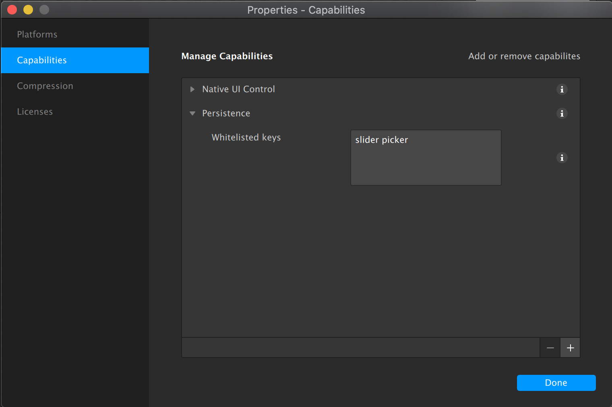

## Using persistence in Spark to save values between user sessions

[Persistence module documentation](https://sparkar.facebook.com/ar-studio/learn/documentation/reference/classes/persistencemodule)

Make sure to whitelist your keys (space separated) in project > properties > capabilities > whitelisted keys

